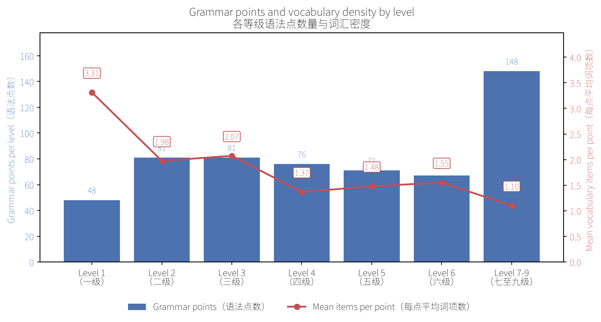
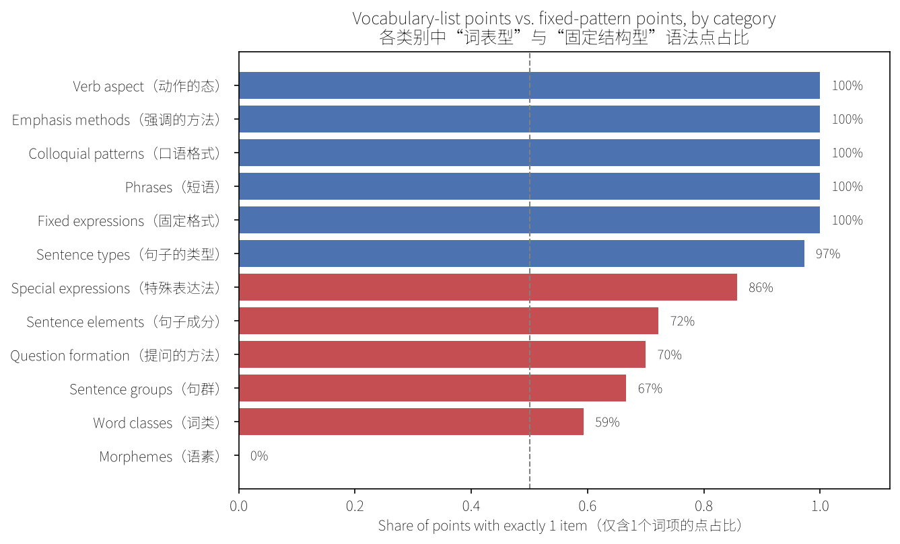
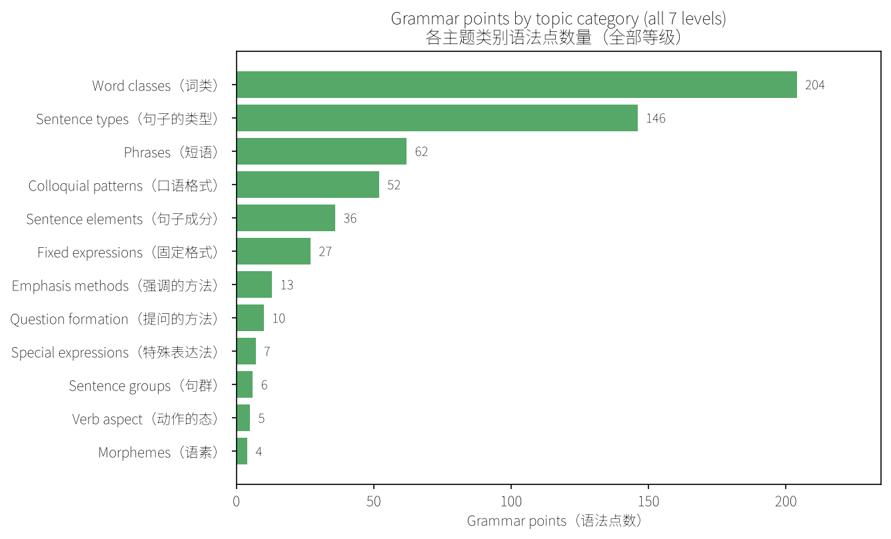
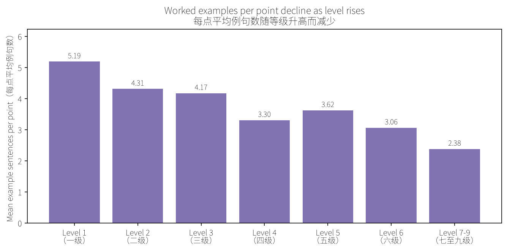
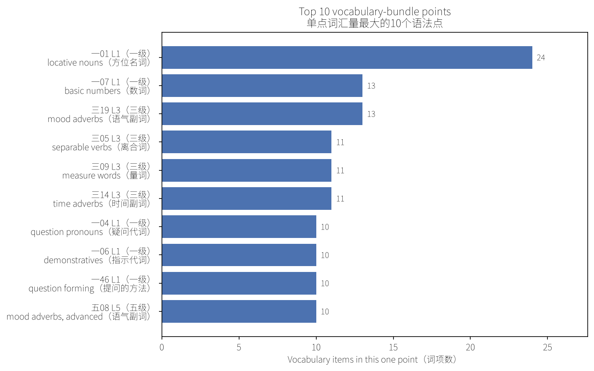
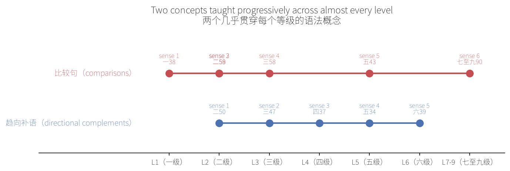

# Insights for learners: what this grammar outline actually teaches

This reads `outcome/processed.md` (the cleaned Appendix A of GF 0025-2021,
the official grading standard for grammar points in international Chinese
language education) through the lens of a learner, not an engineer. The
numbers come straight from `notebooks/eda.ipynb`; nothing here is estimated.
The scope is the full outline: 572 grammar points（语法点）across 283
headings, spanning Level 1 through Level 7-9（一级至七至九级）.

**Methodology.** Every number below is computed by `src/common/eda.py`
(`parse_document`, `split_label_items`) run from `notebooks/eda.ipynb`
against `outcome/processed.md`, never estimated by hand. Each section ends
with a *Source* line naming the exact function, notebook cell, or shell
check it came from, so any claim here can be re-run and checked rather than
taken on faith.

## 1. The point count is not evenly spread across levels

Level 2 and Level 3（二级、三级）introduce the most *new* individual grammar
points (81 each), more than Level 1（一级, 48）and more than any level after
Level 3. Point count then declines through Level 4 to Level 6（四级至六级:
76, 71, 67）before jumping to 148 at Level 7-9（七至九级）.

That last jump is not what it looks like. Level 7-9 is one combined outline
entry covering three official levels at once, so its true per-level rate is
about 148 / 3 ≈ 49, almost identical to Level 1's 48. Read the chart as: the
real growth curve peaks at Level 2-3 and then flattens out, it does not keep
accelerating toward the advanced end. For a learner, that means the
heaviest *new-pattern* load sits right after the beginner stage, not at the
top.

*Source: `df["level_title"].value_counts()` in `notebooks/eda.ipynb`
section 3.1 (blue bars, `img/level_growth.png`).*

## 2. Early levels teach vocabulary; late levels teach structure

The red line in the same chart is the mean number of enumerated items（词
项, words/forms separated by `、`/`；`) packed into a single grammar point.
It starts at 3.31 for Level 1, dips to about 2 for Level 2-3, then keeps
falling to 1.10 by Level 7-9.

This is the more useful signal than raw point count. A Level 1 point like
`方位名词` (locative nouns) bundles 24 words under one grammar point (上,
下, 里, 外, ... 北边), so "learning one grammar point" at the beginner stage
often means memorizing a small vocabulary set that all follows the same
rule. By Level 7-9, a point is almost always exactly one specific
construction or idiom, not a word list. Practically: study strategy should
shift from "memorize this word group" at the beginner stage to "drill this
one exact structure until it's automatic" at the advanced stage.

*Source: `split_label_items()` in `src/common/eda.py`, aggregated as
`df.groupby("level_title")["n_items"].mean()` in `notebooks/eda.ipynb`
section 6.3 (red line, `img/level_growth.png`); the `方位名词` example is
point 一01, see section 8.1 below.*

## 3. Two different kinds of "grammar point" live under the same label

Splitting every point's label by `、`/`；` and checking how often a point
has exactly one item confirms this at the category level, not just per
level:

- Categories that are essentially **word lists tagged as grammar**:
  Word classes（词类, 59% single-item）, Sentence groups（句群, 67%）,
  Question formation（提问的方法, 70%）, Sentence elements（句子成分, 72%）.
  Morphemes（语素）is 0%, every single one of its 4 points is a small
  cluster of related morpheme forms.
- Categories that are almost always **one fixed construction per point**:
  Sentence types（句子的类型, 97%）, Fixed expressions（固定格式, 100%）,
  Colloquial patterns（口语格式, 100%）, Emphasis methods（强调的方法,
  100%）, Verb aspect（动作的态, 100%）, Phrases（短语, 100%）.

For a learner this is a study-method split, not just a data curiosity: word
class points reward spaced-repetition vocabulary drilling, sentence type /
fixed expression points reward sentence-pattern drilling with varied
example sentences instead.

*Source: `df.groupby("category_top")["n_items"].apply(lambda s: (s ==
1).mean())` in `notebooks/eda.ipynb` section 6.4
(`img/vocab_vs_pattern.png`).*

## 4. Where the bulk of the syllabus actually sits

Two categories, Word classes（词类, 204 points）and Sentence types（句子的
类型, 146 points）, together make up 350 of the 572 points: 61% of the
entire outline. Phrases（短语, 62）and Colloquial patterns（口语格式, 52）
are a distant third and fourth. Everything else (emphasis methods, question
formation, special expressions, sentence groups, verb aspect, morphemes)
totals under 50 points combined.

Practically: mastering word-class usage rules and sentence-type patterns
alone covers more than half of this entire grading standard. That is the
highest-leverage place to focus study time if the goal is broad coverage
rather than completeness.

*Source: `df["category_top"].value_counts()` in `notebooks/eda.ipynb`
section 3.2 (`img/category_volume.png`).*

## 5. Some topics only exist at one end of the curriculum

| Category | L1 | L2 | L3 | L4 | L5 | L6 | L7-9 |
|---|---|---|---|---|---|---|---|
| 动作的态 (verb aspect) | X | X | | | | | |
| 提问的方法 (question forming) | X | X | X | | | | |
| 特殊表达法 (special expr.) | X | X | X | X | | | |
| 强调的方法 (emphasis methods) | | X | X | X | X | X | X |
| 口语格式 (colloquial patterns) | | X | X | X | X | X | X |
| 固定格式 (fixed expressions) | | X | X | X | X | X | X |
| 句群 (sentence groups) | | | | | X | | X |

(only the categories that are *not* present at every level are shown; 词类,
句子的类型, 句子成分, 短语 appear at all 7 levels and are omitted here)

- Sentence groups（句群, discourse-level cohesion across multiple
  sentences）first appears at Level 5, is absent at Level 6, then returns at
  Level 7-9. It never appears at Level 1-4 at all: it is not a beginner or
  intermediate skill in this standard, it is introduced specifically as an
  advanced-stage topic.
- Verb aspect markers（动作的态）stop after Level 2, Question formation
  methods（提问的方法）stop after Level 3, and Special expressions（特殊表
  达法）stop after Level 4. Each one has a hard cutoff level after which the
  standard introduces no further new points in that category; by the time a
  learner reaches Level 5-6, these are assumed fully covered, not that they
  stopped mattering.
- Emphasis methods（强调的方法）, Colloquial patterns（口语格式）, and
  Fixed expressions（固定格式）all first appear at Level 2, not Level 1,
  confirming that beginners are not expected to handle emphasis structures,
  colloquial fixed patterns, or fixed expressions yet.

*Source: `df.pivot_table(index="category_top", columns="level_title",
values="label", aggfunc="count")` (presence table above built directly from
this pivot), cross-checked against
`df[df.category_top=="句群"]["level_title"].unique()` and the equivalent
per-category `.unique()` calls; not yet a notebook cell, run directly
against `outcome/processed.md` via `src/common/eda.py`.*

## 6. Fewer worked examples at higher levels

Average example sentences per point drops from 5.19 at Level 1 to 2.38 at
Level 7-9. The decline is not perfectly monotonic (Level 5 ticks back up to
3.62 from Level 4's 3.30), but the overall direction is clear: the standard
gives progressively less practice material per point as difficulty
increases, so learners working through the advanced levels should expect
to supplement each point with their own example sentences rather than
relying on the source material alone.

*Source: `df.groupby("level_title")["n_example_lines"].mean()`, the same
`n_example_lines` field used in section 3.3 of `notebooks/eda.ipynb`.*

## 7. The standard rarely cross-links points for you

Only 4 explicit `见【...】` (see also) cross-references exist across the
entire 572-point outline. The standard does not systematically point out
which advanced pattern extends which beginner pattern, so tracking how a
Level 1 structure evolves into its Level 3 or Level 5 form is left to the
learner (or a category-path-based tool like this one), not something the
source document does for you. The full list of all 4 is in section 8.4
below, none omitted.

*Source: `len(edges)` in `notebooks/eda.ipynb` section 4.2, where `edges`
comes from exploding the `cross_refs` field (parsed by `CROSSREF_RE` in
`src/common/eda.py`).*

## 8. Specific points worth knowing by name

The aggregate numbers above are useful for planning, but a few individual
points are worth flagging on their own, they don't show up in any chart.

### 8.1 The "big bundle" points

A handful of points quietly carry most of the vocabulary load. Learning
just these ten points front-loads over 100 words:

| Point | Level | Category | Items | Label |
|---|---|---|---|---|
| 一01 | Level 1（一级）| 名词 | 24 | 方位名词: 上、下、里、外、前、后... (locative nouns) |
| 一07 | Level 1（一级）| 数词 | 13 | 一、二/两、三、四... (basic numbers) |
| 三19 | Level 3（三级）| 副词 | 13 | 语气副词: 白、并、当然、到底... (mood adverbs) |
| 三05 | Level 3（三级）| 动词 | 11 | 动宾式离合词: 帮忙、点头、放假... (separable verb-object words) |
| 三09 | Level 3（三级）| 量词 | 11 | 名量词: 把、行、架、群、束... (noun measure words) |
| 三14 | Level 3（三级）| 副词 | 11 | 时间副词: 本来、才、曾经... (time adverbs) |
| 一04 | Level 1（一级）| 代词 | 10 | 疑问代词: 多、多少、几、哪... (question pronouns) |
| 一06 | Level 1（一级）| 代词 | 10 | 指示代词: 这、那、这儿、那儿... (demonstrative pronouns) |
| 一46 | Level 1（一级）| 提问的方法 | 10 | the same question-pronoun set, restated as a question-forming method |
| 五08 | Level 5（五级）| 副词 | 10 | 语气副词: 毕竟、不免、差点儿... (mood adverbs, advanced set) |

*Source: `df.nlargest(10, "n_items")` in `notebooks/eda.ipynb` section 6.2,
category glosses added by hand for readability, item counts are not.*

### 8.2 Same character, different level, different job

Some single characters reappear at a *later* level carrying a completely
different grammatical function, marked in the source with a digit or
superscript (从1 vs 从2, and so on). Seeing a familiar character again does
not mean review, in these cases it means a new function is being taught and
the two uses should not be conflated:

- 从: sense 1 at 一15（Level 1）, sense 2 at 二24（Level 2）
- 向: sense 1 at 二23（Level 2）, sense 2 at 三24（Level 3）
- 为: sense 1 at 二28（Level 2）, sense 2 at 三23（Level 3）
- 才: sense 1 at 二20（Level 2）, sense 2 at 三14（Level 3）
- 由: sense 1 at 三20（Level 3）, sense 2 at 五11（Level 5）
- 啊: sense 1 at 二34（Level 2）, sense 2 at 四22（Level 4）
- 并: sense 1 at 三19（Level 3）, sense 2 at 四19（Level 4）
- 而: sense 1 at 四20（Level 4）, sense 2 at 六20（Level 6）
- 同 / 与: both senses actually land at 六15 and 六20（Level 6）, the only
  pair in the outline where the split happens inside a single level rather
  than across levels

*Source: items ending in a digit or superscript (`从1`, `就²`, ...) found by
regex-matching the output of `split_label_items()` for every point, grouped
by their base character, and filtered to bases with 2+ occurrences (ad hoc
script, not yet a permanent notebook cell; the underlying `split_label_items`
function is the same one used in section 2/6.1).*

### 8.3 The point that gets taught at almost every single level

比较句（comparison sentences）is the only concept in the entire outline
that recurs at essentially every stage: 比较句1（一38, Level 1）, 比较句2
and 比较句3（二58, 二59, Level 2）, 比较句4（三58, Level 3）, 比较句5（五43,
Level 5）, 比较句6（七至九90, Level 7-9）. If one grammar concept deserves
tracking across the whole curriculum instead of studying level by level in
isolation, this is it.

趋向补语（directional complements）is close behind: 趋向补语1 through
趋向补语5 land at 二50, 三47, 四37, 五34, 六39, one new layer at every
single level from Level 2 through Level 6 with no gaps, unlike most
progressions above which skip levels.

*Source: same homograph grouping as section 8.2, filtered to the two bases
(`比较句`, `趋向补语`) with the longest chains; plotted in
`img/progression_chains.png`.*

### 8.4 Every explicit cross-reference in the document

Only 4 exist in the whole 572-point outline (see docs/process.md's EDA
notes), which makes them worth reading directly instead of as a statistic:

- 二09（千、万、亿）points to 二72（序数表示法, ordinal-number expressions）
- 二55（"有"字句2）points to 二58（比较句2）
- 二56（存现句1: 表示存在, existential sentences）points to 一37（"有"字句1）,
  confirming the Level 2 existential-sentence pattern is a direct extension
  of the Level 1 有-sentence, not a new structure from scratch
- 二74（用"就"表示强调）points to 二60（是..."的"句, the 是...的 emphasis
  construction）

*Source: `edges["to_label"].value_counts()` in `notebooks/eda.ipynb`
section 4.2, cross-checked against the raw `cross_refs` list per point (no
edges filtered out or summarized, all 4 shown above).*

### 8.5 32 single-character points, and where they cluster

32 points across the outline are exactly one character (在, 比, 当, 往,
对, 给, 离, 喂, 朝, 自, 替, 将, 凭, 于, 因, 除, 据, and more). Nearly half of
them, 15 of the 32, sit specifically at Level 7-9（七至九级）: 尽, 蛮, 颇,
凡, 皆, 即, 尚, 亦, 未, 勿, 乃, 趁, 依, 之, 矣. These are literary/classical
register（书面语）characters, single-character equivalents of words already
learned in their everyday form (e.g. 皆 for 都, 未 for 没, 尚 for 还). This
is a distinct skill from "harder grammar": Level 7-9 specifically expects
learners to recognize a formal written register, not just longer sentences.

*Source: `df[df.label.str.len() == 1]` (32 rows), the same `label_len`
field computed in `notebooks/eda.ipynb` section 3.4; the Level 7-9 subset
counted from that same filtered table.*

### 8.6 A numbering gap worth a manual check

就（"just" / "then"）appears as 就1（二17）, 就2（二20）, 就4（五08）, and
就5（七至九50）, sense 3 is never labeled anywhere in the document. Every
other integrity check in this project (heading codes, bracket-point
numbering, see docs/process.md and notebooks/eda.ipynb) came back with zero
gaps, so this specific one stands out. It may be intentional in the source
standard's own sense-numbering, or it may be worth a direct check against
the physical standard if the 就3 sense matters for study.

*Source: `grep -n '就3\|就³' outcome/processed.md` returns zero matches;
`就1`/`就2`/`就4`/`就5` locations found via the same homograph grouping as
section 8.2, all four are the complete set found, not a sample.*

## Source

All figures computed by `notebooks/eda.ipynb` and `src/common/eda.py`
against `outcome/processed.md` (572 grammar points, 283 headings, 0
structural anomalies found; see `docs/process.md` for how that file was
cleaned from raw OCR output).
